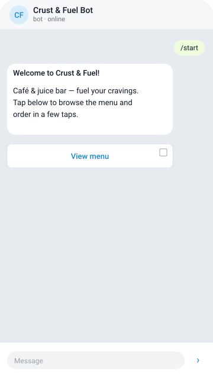
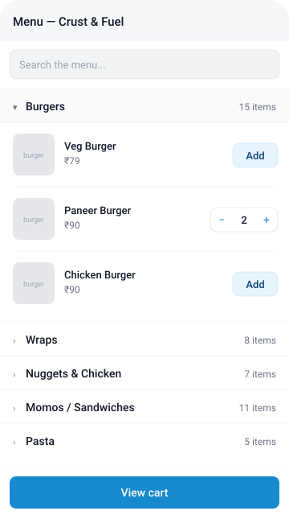
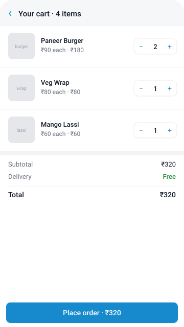
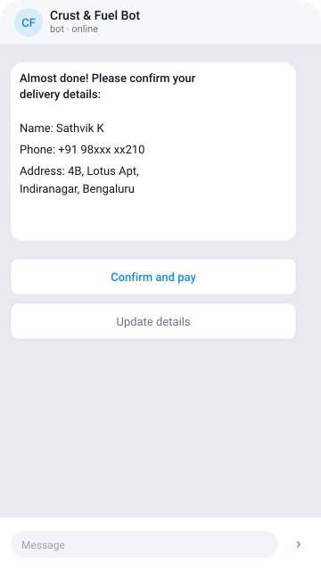
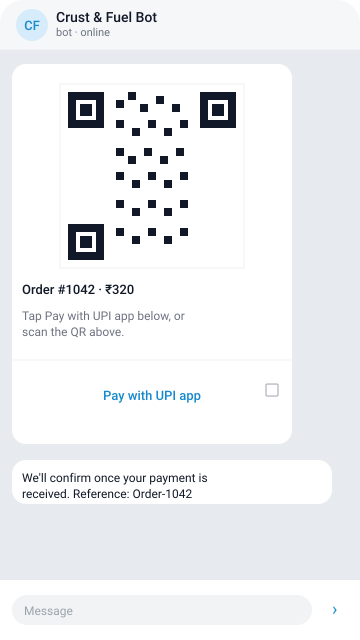
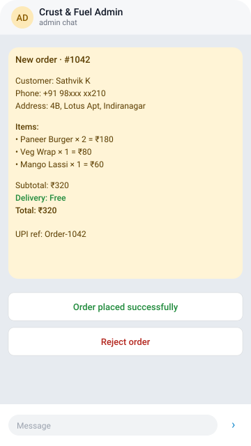
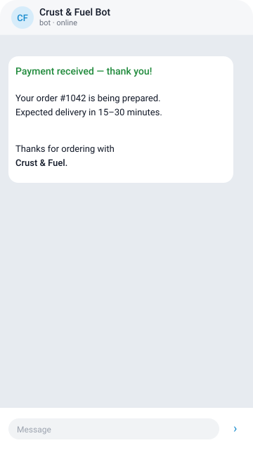

# Crust & Fuel Bot

A Telegram food-ordering bot with a Mini App catalog, REST API, Postgres, and UPI payments validated by an admin via Telegram.

See [`IMPLEMENTATION_PLAN.md`](./IMPLEMENTATION_PLAN.md) for the full architecture, schema, and design rationale.

---

## UI screens

End-to-end flow from `/start` through admin confirmation. Screens 2–3 are the
Mini App (opened fullscreen inside Telegram); 1, 4, 5, 7 are bot DMs; 6 is the
admin's chat with the bot.

<table>
  <tr>
    <td align="center"><b>1 · Start</b><br/><sub>welcome + View menu</sub></td>
    <td align="center"><b>2 · Menu (Mini App)</b><br/><sub>accordion · search · stepper</sub></td>
    <td align="center"><b>3 · Cart (Mini App)</b><br/><sub>line items · totals · CTA</sub></td>
  </tr>
  <tr>
    <td></td>
    <td></td>
    <td></td>
  </tr>
  <tr>
    <td align="center"><b>4 · Customer details</b><br/><sub>confirm or update</sub></td>
    <td align="center"><b>5 · UPI QR</b><br/><sub>scan or tap to pay</sub></td>
    <td align="center"><b>6 · Admin view</b><br/><sub>mark paid or reject</sub></td>
  </tr>
  <tr>
    <td></td>
    <td></td>
    <td></td>
  </tr>
  <tr>
    <td align="center"><b>7 · Confirmed</b><br/><sub>order placed message</sub></td>
    <td></td>
    <td></td>
  </tr>
  <tr>
    <td></td>
    <td></td>
    <td></td>
  </tr>
</table>

After the user taps **Place order** in the cart, the Mini App closes and the
bot DMs them to confirm delivery details (or runs the wizard for first-timers).
Once they tap **Confirm and pay**, the bot sends the UPI QR with a tap-to-pay
button (5) and DMs the admin in parallel (6). The admin's tap on
*Order placed successfully* triggers the confirmation message (7).

---

## Quick start

### 1. Install

```bash
npm install
```

### 2. Configure `.env`

The repo ships with a `.env` containing the development Postgres URL. You still need to fill in:

- `BOT_TOKEN` — get it from [@BotFather](https://t.me/BotFather)
- `BOT_USERNAME` — bot's username (without `@`)
- `ADMIN_CHAT_ID` — your Telegram numeric chat ID (DM `@userinfobot` to get it)
- `PUBLIC_URL` — public HTTPS URL where the Mini App is reachable. For local dev, run `ngrok http 3000` and paste the resulting `https://*.ngrok-free.app` URL here

### 3. Database

```bash
npx prisma generate         # generate Prisma client
npx prisma db push          # apply schema to the DB (no migrations folder yet)
npm run db:seed             # populate sample items
```

Use `npx prisma studio` to inspect tables in a browser.

### 4. Set Mini App domain

In `@BotFather`:
1. `/mybots` → pick your bot → `Bot Settings` → `Menu Button` (optional) or `Configure Mini App`.
2. Set the Web App URL to `${PUBLIC_URL}/miniapp/`.

### 5. Run

```bash
npm run dev
```

Bot starts in long-polling mode. API listens on `:3000`. Mini App is served at `/miniapp/`.

Send `/start` to your bot in Telegram to verify.

---

## Project structure

```
src/
  index.js                   entry — boots Express + Telegraf
  config.js                  env loader (zod-validated)
  db.js                      Prisma singleton
  logger.js                  pino instance
  router/                    Express route registration
  middleware/                telegramAuth, adminAuth, error
  controllers/               request parsing, response shaping
  services/                  business logic
  dal/                       Prisma queries
  bot/                       Telegraf instance + handlers
prisma/
  schema.prisma              data model
  seed.js                    sample items
public/
  miniapp/                   static Mini App (HTML/CSS/JS)
```

The flow for any HTTP request: `router → middleware → controller → service → dal → db`.
The flow for any bot event: `bot/<handler>.js → service → dal → db`.

---

## Useful scripts

| Command              | What it does                                           |
| -------------------- | ------------------------------------------------------ |
| `npm run dev`        | Start with nodemon (auto-restart on file changes)      |
| `npm start`          | Plain node (production)                                |
| `npm run db:push`    | Sync schema to DB without creating migrations          |
| `npm run db:migrate` | Create a migration (production-safe)                   |
| `npm run db:seed`    | Populate items table                                   |
| `npm run db:studio`  | Open Prisma Studio in browser                          |

---

## Production deploy notes

- Switch from polling to webhooks: set `WEBHOOK_URL` env var, mount the webhook handler in `src/index.js`.
- Run `npx prisma migrate deploy` on boot.
- Mini App requires HTTPS — Railway/Render/Fly all give that out of the box.
- Whitelist your `PUBLIC_URL` domain in `@BotFather` → `/setdomain`.
